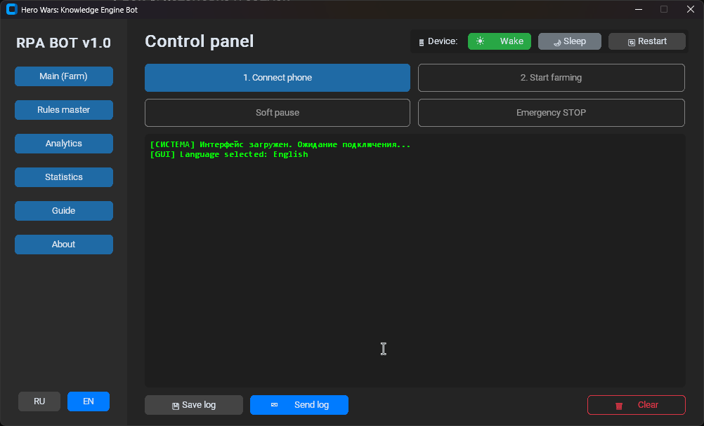
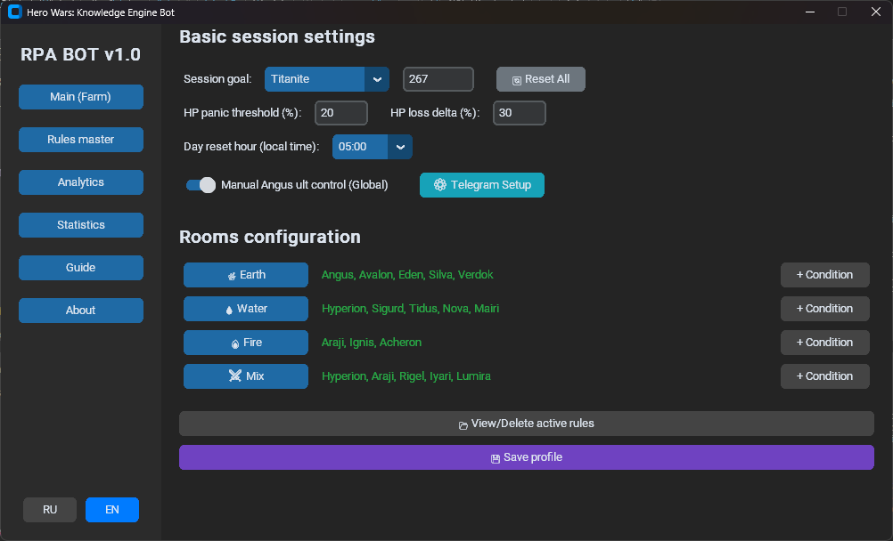
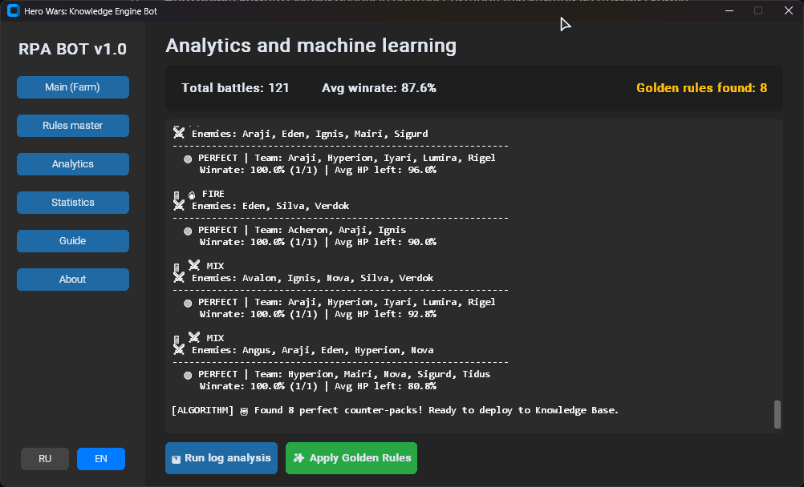
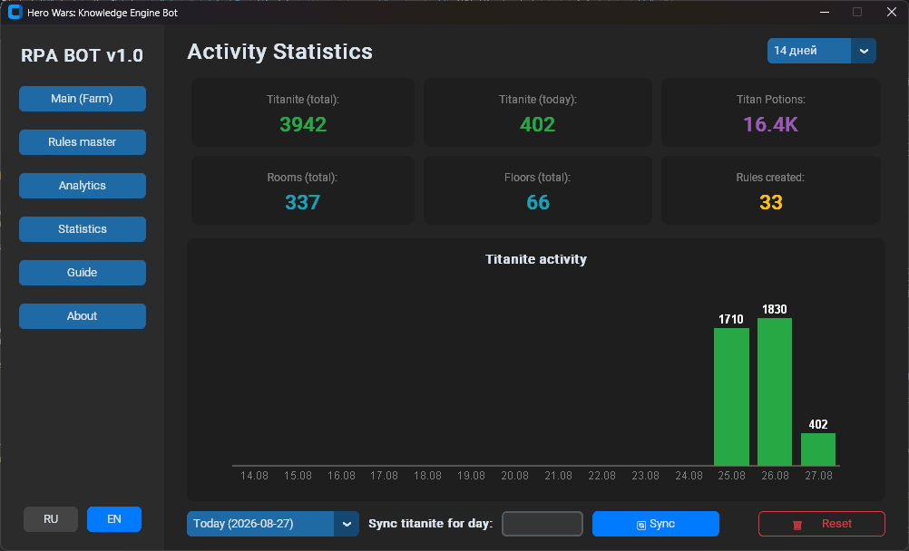
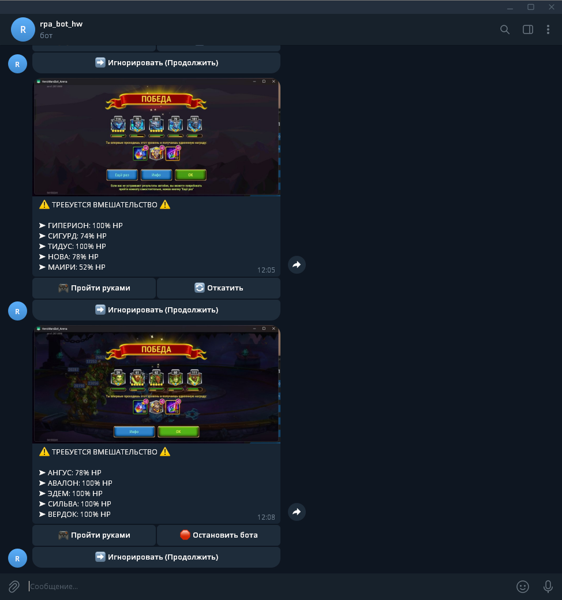

# Hero Wars: Knowledge Engine Bot 🤖⚔️

Imagine a player who never gets tired, never loses focus, instantly reacts when an ally's health drops, and remembers the exact stats of every single battle. That's the **Knowledge Engine Bot** — an autonomous RPA (Robotic Process Automation) agent built for *Hero Wars*.

Unlike basic auto-clickers that blindly tap the same spots on the screen and break the second your game lags, this bot actually has artificial "vision" and a strict logic engine under the hood:

*   **It sees (Computer Vision):** The bot literally watches your PC screen using OpenCV algorithms. It detects enemy icons and calculates Titan health (HP) and energy levels on the fly using HSV color masks. Since it relies on relative math (percentages) rather than hardcoded pixels, it doesn't care what your monitor's resolution is — it just adapts.
*   **It thinks (State Machine):** The core of the bot runs on a "State Machine" architecture. The software always knows exactly what's happening right now (whether it's standing in the hallway, picking a team, or fighting). This means game animations or emulator lags won't cause it to freeze or glitch out.
*   **It plays fair:** The bot **does not** mess with the game files, it doesn't inject code into RAM, and it doesn't hook into private APIs. It controls the game strictly by looking at your phone's screen mirror (`scrcpy`) and imitating real mouse movements and clicks. To any anti-cheat system out there, it just looks like a highly focused, very methodical human sitting at the keyboard.

## ⚙️ Under the Hood (Architecture)

The project relies on a modular architecture where every piece has its own strict job:

*   **State Machine (`main.py`):** The bot's main loop runs as a finite state machine with strict states (`HALLWAY`, `ROOM_SELECTION`, `SET_TEAM`, `WAIT_FOR_OK`). This is a lifesaver — it prevents the bot from freezing or breaking when the game interface lags. It communicates with the GUI process through a non-blocking command queue (`sys.stdin` -> `queue.Queue`).
*   **Computer Vision (`vision.py` & `analyzer.py`):** 
    *   Uses `mss` for high-speed screen capture and `cv2.matchTemplate` to find UI elements.
    *   Implements the Singleton pattern to cache loaded images directly in RAM (`TEMPLATE_CACHE`). It also includes a custom `imread_cyrillic` wrapper for safe file reading on Windows.
    *   Analyzes Titan HP and Energy by applying color HSV masks (isolating green and yellow-white pixels) and calculating their width relative to the base screen resolution.
*   **Rules Engine (`rules_engine.py`):** The decision-making core. It parses your `profile.yml` and room configs. It strictly follows priorities: first, it checks "rescue" rules (critical HP/Energy drops), and only then applies tactical rules (counter-packs against specific enemies).
*   **Machine Learning & Analytics (`analytics_parser.py`):** Every battle is logged into a `.jsonl` file. The analytics module calculates the winrate of each team. If a combo hits a Winrate >= 80% over several fights, the algorithm suggests embedding it into the bot's Knowledge Base as a "Golden Rule".

## 🌟 Key Features & Interface

### 🎛 Control Dashboard:
A modern, dark-themed graphical interface built on `CustomTkinter` with seamless English and Russian (RU/EN) localization.

This is the heart of the bot. Everything you need to control the farming process is packed into one clean interface:
*   **Simple 2-Click Launch:** First, link your phone (`1. Connect phone`), then fire up the bot (`2. Start farming`). No need to type any console commands.
*   **Direct Device Control:** The `Wake`, `Sleep`, and `Restart` buttons let you manage your phone's screen directly from your PC. You can actually turn the physical screen off to save battery and prevent burn-in while the bot keeps playing in the background.
*   **Safety & Control:** The `Soft pause` button tells the bot to finish the current battle, walk out to the hallway, and wait for you. `Emergency STOP` instantly kills the bot process if something goes wrong.
*   **Live Terminal:** The black console window shows exactly what the bot is thinking and doing in real-time (which room it found, what team it picked, HP stats). You can quickly save these logs or send them to the developer with a single click.

### ⚙️ Smart Rule Builder & Session Master:
A visual constructor that lets you create dynamic, custom tactics. You can command the bot to soft-pause or swap the team if a specific Titan's HP drops below a critical threshold, or if it encounters specific dangerous enemies.

Take full control over the bot's logic without touching a single line of code. All settings are seamlessly mapped to the internal Rules Engine.
*   **Session Limits & Safety:** Define exact farming goals (e.g., collect exactly 267 Titanite). Set global safety nets like `HP panic threshold` and `HP loss delta` — if a Titan unexpectedly loses a huge chunk of health in one fight, the bot will trigger an SOS protocol before a fatal wipe happens.
*   **Tactical Room Config:** Assign default elemental teams for Earth, Water, Fire, and Mix dungeon encounters. 
*   **Dynamic Conditions:** Use the `+ Condition` button to build advanced tactical overrides. Tell the bot to automatically swap team compositions or soft-pause if specific dangerous enemies spawn, or if a Titan's health is running low.
*   **Microcontrol & Alerts:** Global toggles for manual Angus Ultimate timings (to perfectly counter enemies) and one-click Telegram setup for remote alerts.

### 🧠 Analytics & Machine Learning:
The bot logs every single battle into a `.jsonl` database. It automatically calculates the Winrate for each team composition. If a titan combo achieves a winrate of >= 80%, the bot suggests embedding it into its Knowledge Base as a "Golden Rule".

The bot doesn't just blindly farm the Dungeon; it actively learns from every battle it fights.
*   **Data Logging:** Every single encounter is meticulously recorded into a local database. The algorithm tracks the room element, the exact enemy lineup, your chosen team, and the remaining HP of your Titans.
*   **Winrate Analysis:** Hitting the `Run log analysis` button forces the bot to process its entire battle history. The built-in terminal clearly highlights the mathematical efficiency of each team composition, marking the flawless ones as "PERFECT".
*   **Golden Rules Discovery:** If a specific Titan combo consistently dominates with an 80%+ winrate, the algorithm automatically flags it as a perfect counter-pack.
*   **Automated Deployment:** A single click on `Apply Golden Rules` instantly injects all discovered successful tactics directly into the Rules Engine. The bot rewrites its own configuration files on the fly, ensuring it will always prioritize these winning teams against those specific enemies in the future.

### 📈 Activity Statistics & Tracking

To keep track of your daily progress, the bot features a comprehensive, built-in analytics dashboard.
*   **Smart Counters:** It tracks everything: total titanite, floors cleared, and Titan Potions earned. Large numbers are automatically formatted for a cleaner look (e.g., 16.4K instead of 16400).
*   **Lightweight Native Chart:** The daily titanite activity bar chart is drawn entirely from scratch using the native `Canvas` widget. This keeps the app extremely lightweight because we didn't have to pack heavy data science libraries into the executable.
*   **Game-Day Logic:** Hero Wars resets the daily cap at 5:00 AM. The bot accounts for this by applying a time-shift to all its logs, ensuring that a late-night farming session is correctly assigned to the previous game-day.
*   **Foolproof Synchronization:** If you play a few runs manually on your phone, you can just type your current titanite into the `Sync` field. The algorithm calculates the delta and updates your rooms and potions accordingly. It even has a built-in safeguard: the bot strictly remembers how much it farmed autonomously and will reject any manual input lower than its own baseline.

### 📱 Telegram Integration (SOS Protocol):
Complete remote control. Receive live battle screenshots directly in your Telegram chat if the bot encounters a critical HP drop. You can manually rollback the fight or change the team using inline buttons right from your phone.

The bot keeps you in the loop, even when you're miles away from your PC.
*   **Smart Alerts:** If a battle goes south (e.g., a Titan's HP unexpectedly drops below your safe threshold), the bot refuses to lose. It soft-pauses the game and instantly sends a live screenshot of the battlefield and HP metrics directly to your phone.
*   **Remote Control:** You don't need to rush back to your monitor. Use the inline buttons in your Telegram chat to command the bot: rollback the fight, ignore the drop and push through, or stop farming entirely.
*   **On-the-fly Team Swapping:** If you decide to rollback the battle, the bot will wait for your instructions. Just type a new Titan combination directly into the chat. The built-in text parser will recognize the heroes, rebuild the team in-game, and dive back into the dungeon automatically!

## 🚀 Installation & Launch (Standalone Release)

For ease of use, the project has been compiled into a standalone `.exe` version for personal use. Download it and enjoy farming to your health!
1. Download the latest release archive from the repository.
2. Extract the archive into any folder on your PC.
3. Run the executable file to launch the Control Dashboard.

**🛑 CRITICAL NOTE ON ASSETS (Anti-Theft Protection)**
The bot's interface will launch successfully, but **it will NOT be able to play** out of the box. 
To protect this project from unfair commercial copying and resale, the `assets/` directory (which contains the OpenCV image templates for game UI, buttons, and Titan avatars) has been **deliberately excluded** from the public release. 
Because the bot relies heavily on Computer Vision, it will be "blind" without these files. You will need to manually capture screenshots of the game elements and place them in your local `assets/` folder, or contact the developer for the resource pack.

## ⚠️ Important Notes & Troubleshooting

### 🛡️ Antivirus False Positives (Windows Defender)
Because this bot utilizes low-level Windows API calls (`ctypes`), screen capturing, and ADB (Android Debug Bridge) to automate processes, **Windows Defender or other antivirus software may occasionally flag the compiled `.exe` file as a threat**. 
* This is a very common **false positive** for compiled Python RPA (Robotic Process Automation) tools.
* If the bot gets blocked from launching or is automatically removed by the system, please **add the bot's executable or folder to your antivirus exceptions/exclusions list**.

### 📱 Clicks Not Registering on the Phone?
If the bot successfully connects, opens the game, but **fails to click** or swipe anything, the issue is almost always related to your Android permissions, not the bot itself.

To fix this, go to your phone's **Developer Options** and ensure the following are enabled:
* **USB Debugging:** Must be enabled.
* **USB Debugging (Security settings):** Must be enabled. *This is the most critical step—it explicitly allows ADB to simulate taps and swipes on your screen.*
* **Install via USB:** (On some devices like Xiaomi/MIUI) Must be enabled.

> **Note:** Depending on your phone manufacturer (Realme, Xiaomi, Oppo, Poco, etc.), the "Security settings" toggle might be named slightly differently, but it is always located right under standard USB Debugging. You must grant the system permission to simulate input events.

## 📄 License

This project is licensed under the **PolyForm Noncommercial 1.0.0** License. 
The software is provided free of charge strictly for **personal use**. Commercial redistribution, selling of this bot, embedding it into paid services, or claiming it as your own commercial product is **strictly prohibited**.

---
**Developed with ❤️ by Platon Petrunin**
